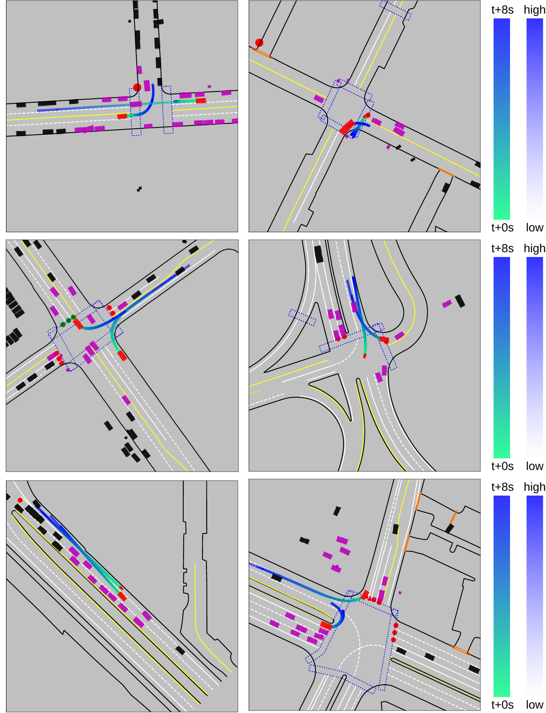

# GameFormer
[Zhiyu Huang](https://mczhi.github.io/), [Haochen Liu](https://scholar.google.com/citations?user=iizqKUsAAAAJ&hl=en), [Chen Lv](https://scholar.google.com/citations?user=UKVs2CEAAAAJ&hl=en) 

[AutoMan Research Lab, Nanyang Technological University](https://lvchen.wixsite.com/automan)

## Abstract
Autonomous vehicles operating in complex real-world environments require accurate predictions of interactive behaviors between traffic participants. While existing works focus on modeling agent interactions based on their past trajectories, their future interactions are often ignored. This paper addresses the interaction prediction problem by formulating it with hierarchical game theory and proposing the GameFormer framework to implement it. Specifically, we present a novel Transformer decoder structure that uses the prediction results from the previous level together with the common environment background to iteratively refine the interaction process. Moreover, we propose a learning process that regulates an agent's behavior at the current level to respond to other agents' behaviors from the last level. Through experiments on large-scale real-world driving datasets, we demonstrate that our model can achieve state-of-the-art prediction accuracy on the interaction prediction task. We also validate the model's capability to jointly reason about the ego agent's motion plans and other agents' behaviors in both open-loop and closed-loop planning tests, outperforming a variety of baseline methods.

## Method Overview
The proposed framework draws inspiration from hierarchical game-theoretic modeling of agent interactions. The framework encodes the historical states of agents and maps as background information via a Transformer-based encoder. A level-0 agent's future trajectories are decoded independently, based on the initial modality query. At level-k, an agent responds to all other agents at level-(k-1). The level-0 decoder uses modality embedding and agent history encodings as query inputs to independently decode the future trajectories and scores for level-0 agents. The level-k decoder incorporates a self-attention module to model the future interactions at level-(k-1) and appends this information to the scene context encoding.


## Interaction Prediction (Waymo)
Given the tracks of agents for the past 1 second on a corresponding map, the objective is to predict the joint future positions of 2 interacting agents for 8 seconds into the future.



## Closed-loop Planning (Waymo)
The planner outputs a planned trajectory at each time step, which is used to simulate the vehicle’s state at the next time step. The other agents are replayed from a log according to their observed states in the dataset.

| <video muted controls width=380> <source src="./src/5bcb4673b6c09a82.mp4"  type="video/mp4"> </video> | <video muted controls width=380> <source src="./src/37a22aeabedd4d1e.mp4"  type="video/mp4"> </video> |

| <video muted controls width=380> <source src="./src/2ef8b857eb575693.mp4"  type="video/mp4"> </video> | <video muted controls width=380> <source src="./src/28dd7530f690a80c.mp4"  type="video/mp4"> </video> |

| <video muted controls width=380> <source src="./src/93a82dbe9425898c.mp4"  type="video/mp4"> </video> | <video muted controls width=380> <source src="./src/b66100c3bccb68fa.mp4"  type="video/mp4"> </video> |

## Closed-loop Planning (nuPlan)
Please refer to the [GameFormer Planner](https://opendrivelab.com/e2ead/AD23Challenge/Track_4_AID.pdf) report for the details of the planning framework. The following scenarios demonstrate the performance of closed-loop planning with non-reactive agents in selected challenging situations from the nuPlan dataset.

| <video muted controls width=380> <source src="./src/5bcb4673b6c09a82.mp4"  type="video/mp4"> </video> | <video muted controls width=380> <source src="./src/37a22aeabedd4d1e.mp4"  type="video/mp4"> </video> |

| <video muted controls width=380> <source src="./src/2ef8b857eb575693.mp4"  type="video/mp4"> </video> | <video muted controls width=380> <source src="./src/28dd7530f690a80c.mp4"  type="video/mp4"> </video> |

| <video muted controls width=380> <source src="./src/93a82dbe9425898c.mp4"  type="video/mp4"> </video> | <video muted controls width=380> <source src="./src/b66100c3bccb68fa.mp4"  type="video/mp4"> </video> |

## Citation
```
@article{huang2023gameformer,
  title={GameFormer: Game-theoretic Modeling and Learning of Transformer-based Interactive Prediction and Planning for Autonomous Driving},
  author={Huang, Zhiyu and Liu, Haochen and Lv, Chen},
  journal={arXiv preprint arXiv:2303.05760},
  year={2023}
}
```

## Contact
If you have any questions, feel free to contact us (zhiyu001@e.ntu.edu.sg).
