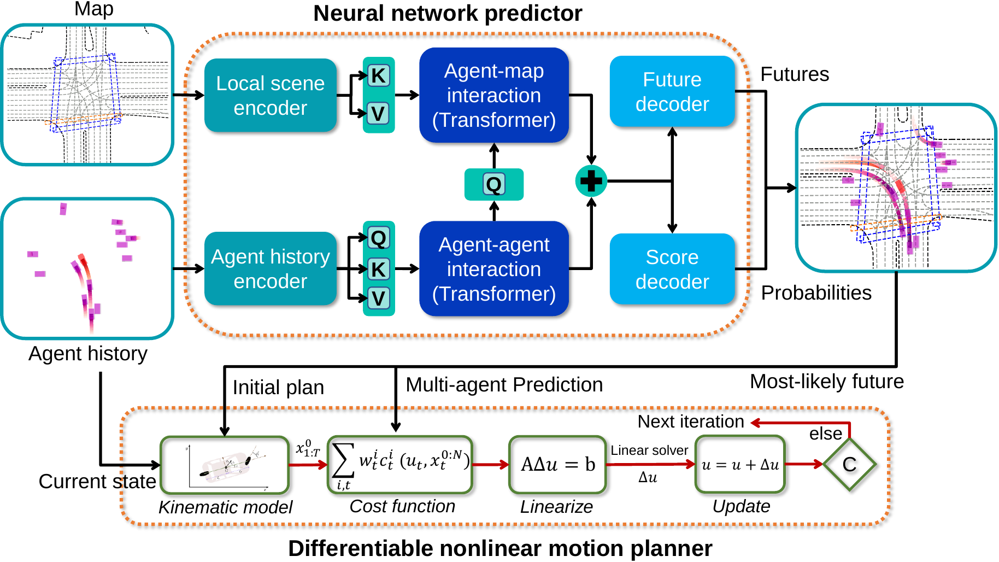

# GameFormer

[Zhiyu Huang](https://mczhi.github.io/), [Haochen Liu](https://scholar.google.com/citations?user=iizqKUsAAAAJ&hl=en), [Chen Lv](https://scholar.google.com/citations?user=UKVs2CEAAAAJ&hl=en) 

[AutoMan Research Lab, Nanyang Technological University](https://lvchen.wixsite.com/automan)

## Abstract

Autonomous vehicles operating in complex real-world environments require accurate predictions of interactive behaviors between traffic participants. While existing works focus on modeling agent interactions based on their past trajectories, their future interactions are often ignored. This paper addresses the interaction prediction problem by formulating it with hierarchical game theory and proposing the GameFormer framework to implement it. Specifically, we present a novel Transformer decoder structure that uses the prediction results from the previous level together with the common environment background to iteratively refine the interaction process. Moreover, we propose a learning process that regulates an agent's behavior at the current level to respond to other agents' behaviors from the last level. Through experiments on a large-scale real-world driving dataset, we demonstrate that our model can achieve state-of-the-art prediction accuracy on the interaction prediction task. We also validate the model's capability to jointly reason about the ego agent's motion plans and other agents' behaviors in both open-loop and closed-loop planning tests, outperforming a variety of baseline methods.

## Method Overview
The proposed framework consists of two parts. First, we build up a holistic neural network to embed the history states of agents and scene context into high-dimensional spaces, encode the interactions between agents and the scene context using Transformer modules, and finally decode different future predicted trajectories and their probabilities. Second, we employ a differentiable optimizer as a motion planner to explicitly plan a future trajectory for the AV according to the most-likely prediction result and initial motion plan. Since the motion planner is differentiable, the gradient from the planner can be backpropagated to the prediction module and the cost function weights can also be learned with the objective to imitate human driving trajectories.



## Closed-loop testing

### Cruising

| <video muted controls width=380> <source src="./src/473df4d0702d0d61.mp4"  type="video/mp4"> </video> | <video muted controls width=380> <source src="./src/ebf548112b4155bd.mp4"  type="video/mp4"> </video> |

### Traffic light

| <video muted controls width=380> <source src="./src/cf4c93a51f255da.mp4"  type="video/mp4"> </video> | <video muted controls width=380> <source src="./src/5af7263eeae8cc38.mp4"  type="video/mp4"> </video> |

### Turning

| <video muted controls width=380> <source src="./src/cf966e6cb27802a3.mp4"  type="video/mp4"> </video> | <video muted controls width=380> <source src="./src/4b7a175072d54d11.mp4"  type="video/mp4"> </video> |

### Emergency

| <video muted controls width=380> <source src="./src/3d43fef395cc20fd.mp4"  type="video/mp4"> </video> | <video muted controls width=380> <source src="./src/8ea14bd2d120c0e4.mp4"  type="video/mp4"> </video> |

### Interaction

| <video muted controls width=380> <source src="./src/60a9ff3762d159d9.mp4"  type="video/mp4"> </video> | <video muted controls width=380> <source src="./src/a7ec124caa56fbda.mp4"  type="video/mp4"> </video> |

| <video muted controls width=380> <source src="./src/73993339ce528fd0.mp4"  type="video/mp4"> </video> | <video muted controls width=380> <source src="./src/f135a85bfd8b8190.mp4"  type="video/mp4"> </video> |

| <video muted controls width=380> <source src="./src/a1f64ce4c1a9f9f8.mp4"  type="video/mp4"> </video> | <video muted controls width=380> <source src="./src/9ba3d538754e86bf.mp4"  type="video/mp4"> </video> |

| <video muted controls width=380> <source src="./src/124ae6902ef59cea.mp4"  type="video/mp4"> </video> | <video muted controls width=380> <source src="./src/84b40c7a7d2fb9b0.mp4"  type="video/mp4"> </video> |

## Citation
```
@article{huang2022differentiable,
  title={Differentiable Integrated Motion Prediction and Planning with Learnable Cost Function for Autonomous Driving},
  author={Huang, Zhiyu and Liu, Haochen and Wu, Jingda and Lv, Chen},
  journal={arXiv preprint arXiv:2207.10422},
  year={2022}
}
```

## Contact

If you have any questions, feel free to contact us (zhiyu001@e.ntu.edu.sg).
